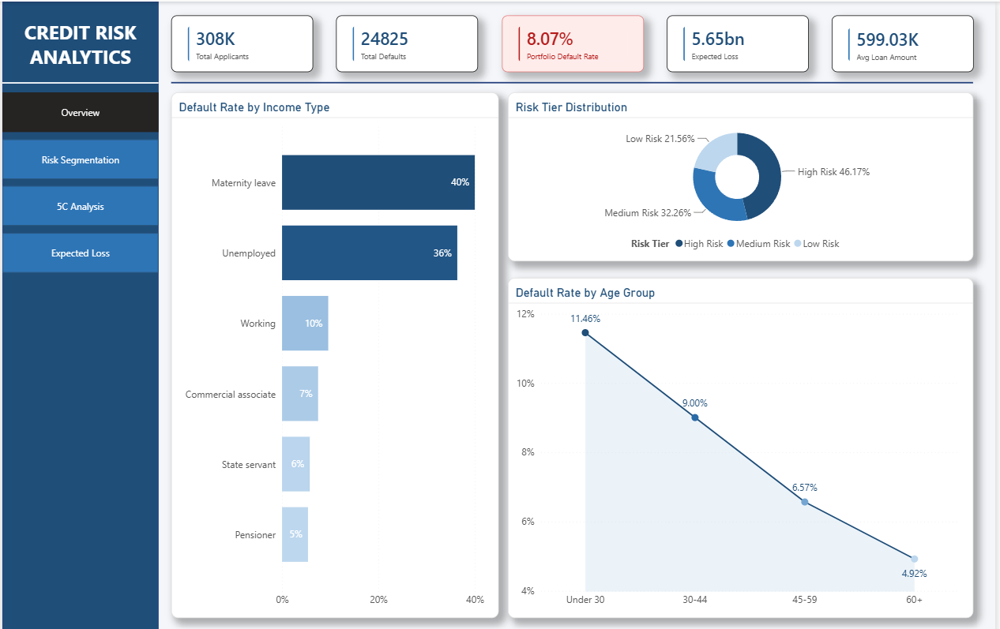
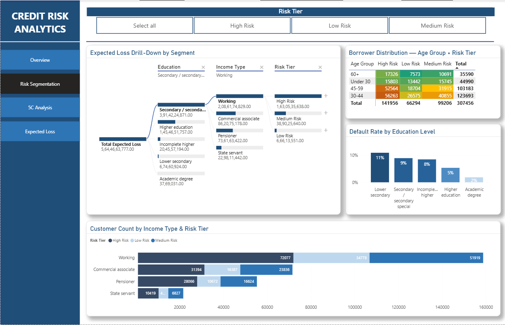
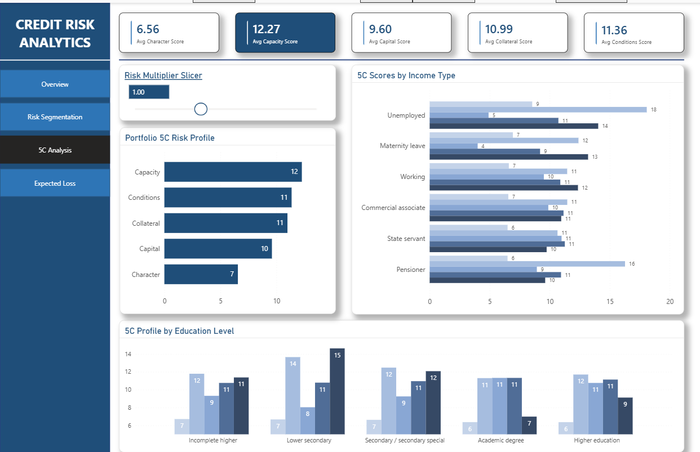
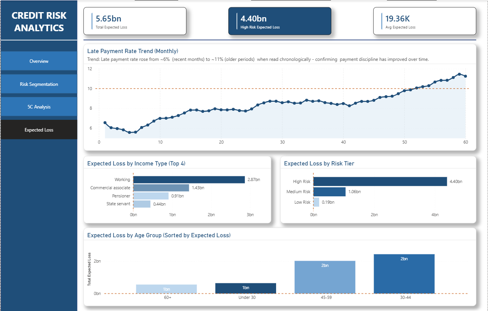

# Credit Risk Analytics

An end-to-end credit risk analytics pipeline built on the [Home Credit Default Risk](https://www.kaggle.com/c/home-credit-default-risk) dataset (307,511 applicants, 17.3M records across 4 relational tables). The project spans three tools — **SQL** for data engineering, **Excel** for financial modelling, and **Power BI** for an interactive live dashboard — all connected to the same underlying database so every number traces back to one source of truth.



## Table of Contents

- [Headline Findings](#headline-findings)
- [Tech Stack](#tech-stack)
- [Project Structure](#project-structure)
- [Stage 1 — SQL](#stage-1--sql-data-engineering--analysis)
- [Stage 2 — Excel](#stage-2--excel-financial-modelling)
- [Stage 3 — Power BI](#stage-3--power-bi-interactive-dashboard)
- [Key Insight](#key-insight)
- [Setup](#setup)
- [Author](#author)

## Headline Findings

| # | Finding | Key Number |
|---|---|---|
| 1 | Education level has a 6x impact on default probability | Lower secondary 10.93% vs Academic degree 1.83% |
| 2 | Default risk decreases linearly with age | Under 25: 12.31% → 55+: 5.21% |
| 3 | Working class drives portfolio EL through volume, not just PD | 3.95B+ of total expected loss |
| 4 | Portfolio Expected Loss ranges 2.6x under stress scenarios | 3.90B (best case) to 10.18B (worst case) |
| 5 | Capacity, not Character, is the dominant 5C risk factor | Avg score 12.27 vs 6.56 |
| 6 | High Risk tier holds 46% of borrowers but 78% of expected loss | 4.40bn of 5.65bn total |

## Tech Stack

**SQL** — PostgreSQL 15, pgAdmin 4, Python (pandas, SQLAlchemy) for data loading
**Excel** — PivotTables, weighted scorecards, Data Table sensitivity analysis
**Power BI** — DirectQuery/Import from PostgreSQL, DAX measures, What-If parameters, Decomposition Tree

## Project Structure

```
credit-risk-analytics/
├── sql/
│   ├── load_data.py                      # Bulk-loads 4 CSVs into PostgreSQL
│   └── credit_risk_sql_walkthrough.sql   # Full SQL pipeline (7 stages)
├── powerbi/
│   └── credit_risk_BI.pbix               # Power BI dashboard (4 pages)
├── docs/
│   └── Credit_Risk_SQL_Report.docx       # Full project documentation
├── img/                                  # Dashboard screenshots used in this README
└── README.md
```

> **Note on large files:** `credit_risk_model.xlsx` and `risk_summary.csv` exceed GitHub's per-file upload limits, so they're distributed as [Release assets](../../releases) instead of being committed directly. See [Setup](#setup) below.

## Stage 1 — SQL (Data Engineering & Analysis)

Loaded 4 CSV files (application, bureau, previous applications, installment payments) into PostgreSQL using a Python bulk-loader, then progressed through SELECT/WHERE basics, GROUP BY aggregation, multi-table JOINs with CTEs, window functions (RANK, PERCENT_RANK, rolling averages), and a final `risk_summary` view consolidating all 4 tables into one 25-column customer risk profile — the single data source feeding both Excel and Power BI.

Data quality handling included converting negative day-count fields (`days_birth`, `days_employed`) into real ages/tenure, and treating the `365243` unemployed placeholder as a NULL rather than a 1000-year tenure outlier.

## Stage 2 — Excel (Financial Modelling)

A 5-sheet workbook built on the SQL output:

- **Risk_Scorecard** — 5-factor weighted risk score (0–100) per customer
- **Expected_Loss** — PD × LGD × EAD model with a 5×5 stress-test sensitivity table
- **5C_Scorecard** — Full 5 C's of Credit framework (Character, Capacity, Capital, Collateral, Conditions) with a radar chart and a model accuracy check against actual defaults
- **Cohort_Analysis** — 4 PivotTables cross-validating the SQL findings

## Stage 3 — Power BI (Interactive Dashboard)

A 4-page dashboard connected live to PostgreSQL.

### Page 1 — Overview
Portfolio KPIs, default rate by income type, risk tier distribution, default rate by age.


### Page 2 — Risk Segmentation
Decomposition tree drill-down, risk heatmap matrix, slicer-driven filtering.



### Page 3 — 5C Analysis
Interactive 5C scorecard with a What-If stress-test slider.



### Page 4 — Expected Loss
Time-series payment trend, EL breakdowns by segment, risk tier, and age.



## Key Insight

The High Risk tier represents 46% of the portfolio by customer count but drives 78% of total expected loss — the single most actionable finding in the project, directly informing where credit risk teams should concentrate monitoring and provisioning resources.

## Setup

1. Run `sql/load_data.py` to load the 4 source CSVs into PostgreSQL.
2. Execute `sql/credit_risk_sql_walkthrough.sql` stage by stage in pgAdmin.
3. Download `credit_risk_model.xlsx` from the [Releases](../../releases) page and refresh the Raw_Data connection.
4. Open `powerbi/credit_risk_BI.pbix` and refresh against your local PostgreSQL instance.

## Author

Aksh Patel — [LinkedIn](https://www.linkedin.com/in/aksh-patel-627007331)
